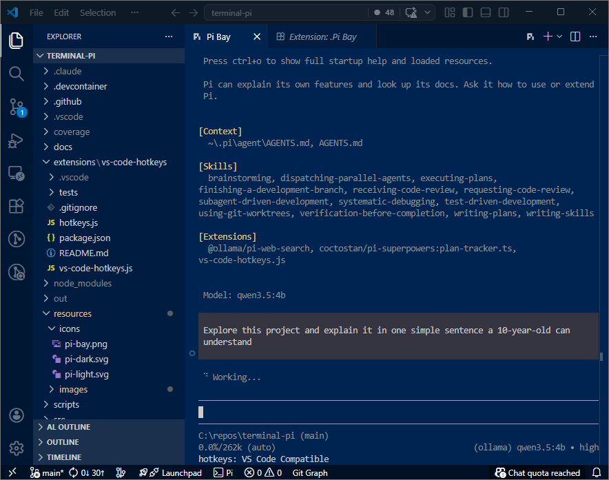

# Pi Dock - Pi Agent Docked in the VS Code Editor Area

<p align="center">
  
</p>

<p align="center">
  <strong>Make <code>pi</code> feel native in VS Code.</strong><br>
  One click to launch. <code>Ctrl+G</code> to write prompts in your favorite editor.
</p>

<p align="center">
  <a href="https://marketplace.visualstudio.com/items?itemName=wiinnie-the-pooh.pi-dock">
    
  </a>
  <a href="https://marketplace.visualstudio.com/items?itemName=wiinnie-the-pooh.pi-dock">
    
  </a>
  <a href="https://github.com/wiinnie-the-pooh/terminal-pi/blob/main/LICENSE">
    
  </a>
</p>

---



## Quick Start

**Prerequisite:** `pi` must be installed and on your PATH.

```sh
npm install -g @mariozechner/pi-coding-agent
```

---

## Features

- **Status bar launcher** - open a fresh Pi session in one click in VS Code `Editor Area`
- **Skill / Template / Extension actions** - run Pi on selected or current resource files, with a filtered Command Palette Quick Pick when no file context exists
- **Ctrl+G external editor** - opens the current `Pi` prompt in an external editor; on save and close, it returns to `Pi`.
- **Configurable** - set default CLI args and choose your editor command

### Status bar launcher

- Every click opens a fresh `Pi Dock` session into VS Code `Editor Area`.

### Run Pi with workspace resources

- Pi Dock exposes four resource actions:
  - `Run Pi with Skill...`
  - `Run Pi with Template...`
  - `Run Pi with Extension...`
  - `Run Pi with Prompt...`

- Resource file rules are strict:
  - **Skill** accepts only `SKILL.md` files and passes their parent directories via repeated `--skill <dir>` flags
  - **Template** accepts only `.md` files excluding `SKILL.md` and passes them via repeated `--prompt-template <file>` flags
  - **Extension** accepts only `.ts` files and passes them via repeated `--extension <file>` flags
  - **Prompt** accepts any non-binary text file and passes it as `@<file>`; set `piDock.promptExtraContext` to append extra context

- **Explorer View** uses the selected files directly:
  - the command is valid only when **all selected files** satisfy that command's criteria
  - mixed selections are rejected; Pi Dock does not ignore mismatched files and continue with a subset

- **Editor / Current File** uses the current file directly:
  - `Run Pi with Skill...` works only when the current file is `SKILL.md`
  - `Run Pi with Template...` works only when the current file is a non-skill `.md`
  - `Run Pi with Extension...` works only when the current file is a `.ts` file

- **Command Palette** is the only picker-based flow:
  - `Pi Dock: Run Pi with Skill...` shows a Quick Pick of workspace `SKILL.md` files
  - `Pi Dock: Run Pi with Template...` shows a Quick Pick of workspace `.md` files excluding `SKILL.md`
  - `Pi Dock: Run Pi with Extension...` shows a Quick Pick of workspace `.ts` files
  - `Pi Dock: Run Pi with Prompt...` shows a File Open dialog (single file, any non-binary text file)

- Command Palette Quick Picks (Skill / Template / Extension) support multi-select within the chosen resource type.

### Edit prompts outside the `Pi` session

- Focus the `Pi Dock` session and press `Ctrl+G` to open the external editor. Write your prompt in an editor tab, then save and close - it is sent back to `Pi`.

- By default, Pi Dock auto-detects the current desktop editor and exports a matching `EDITOR` / `VISUAL` command:
  - VS Code Stable -> `code --wait`
  - VS Code Insiders -> `code-insiders --wait`
  - Cursor -> `cursor --wait`

- If auto-detection cannot find a usable CLI on PATH, Pi Dock preserves your existing `VISUAL` / `EDITOR` values. If none are set, `pi` falls back to its own default behavior.

---

## Commands

| Command                               | Description |
|---------------------------------------|-------------|
| Pi Dock: Run Pi Dock                  | Open an interactive `pi` session |
| Pi Dock: Run Pi with Skill...         | Run Pi with one or more Skill resources sourced from `SKILL.md` files |
| Pi Dock: Run Pi with Template...      | Run Pi with one or more Template resources sourced from non-skill `.md` files |
| Pi Dock: Run Pi with Extension...     | Run Pi with one or more Extension resources sourced from `.ts` files |
| Pi Dock: Run Pi with Prompt...        | Run Pi with a text file as a prompt reference |

---

## Settings

| Setting                              | Default       | Description                                                                          |
|--------------------------------------|---------------|--------------------------------------------------------------------------------------|
| `piDock.defaultArgs`                 | `""`          | Extra CLI flags for every `pi` invocation, e.g. `--model openai/gpt-4o`              |
| `piDock.editorCommand`               | `""` (auto)  | Optional explicit `EDITOR` / `VISUAL` override. Leave empty to auto-detect the current desktop editor CLI |
| `piDock.promptExtraContext`          | `""`          | Extra context argument appended after the `@file` reference in Prompt invocations    |
| `piDock.virtualEnvironmentOverride`  | `true`        | Temporarily disable Python venv activation when creating a Pi terminal               |
| `piDock.virtualEnvironmentDrainMs`   | `150`         | Milliseconds to wait before restoring venv activation (ignored when override is off) |

---

<details>
<summary>Building from source</summary>

```sh
npm install
npm run compile
npm test
```

For manual verification in a live VS Code instance, see `TESTING.md`.

### Packaging

```sh
npm run package
# Produces: pi-dock-<version>.vsix
code --install-extension pi-dock-<version>.vsix
```

</details>

---

## Links

- [Pi Dock CLI on npm](https://www.npmjs.com/package/@mariozechner/pi-coding-agent)
- [GitHub Repository](https://github.com/wiinnie-the-pooh/terminal-pi)
- [Report an Issue](https://github.com/wiinnie-the-pooh/terminal-pi/issues)
- [Changelog](CHANGELOG.md)
